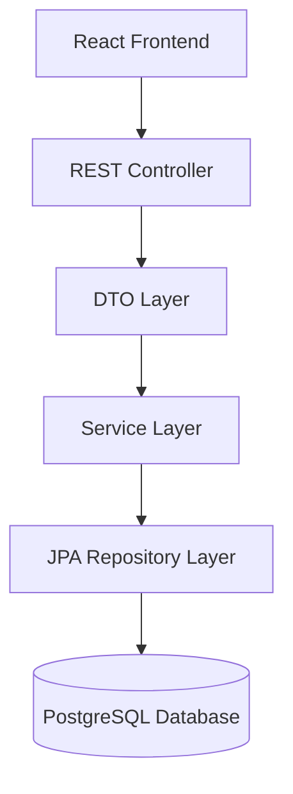
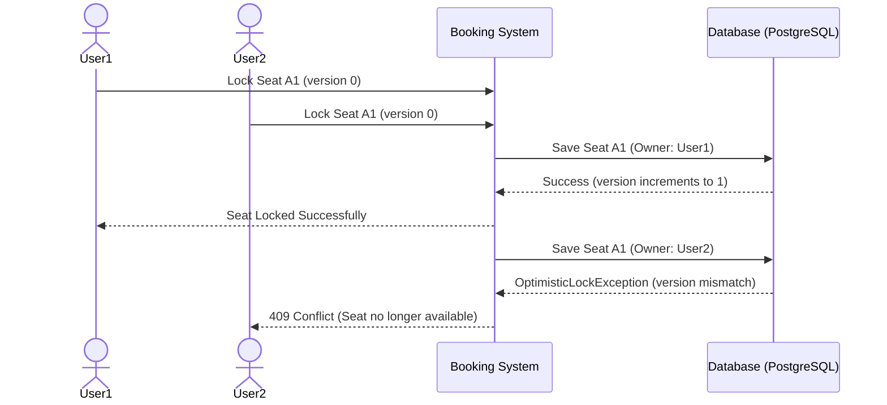

# Event Ticket Booking System

A production-ready full-stack Event Ticket Booking System showcasing clean layered architecture and concurrent seat locking (Optimistic Locking).
live link: https://eventify-five-lilac.vercel.app/

## 🚀 Features

- **Concurrent Seat Locking**: Prevents double-booking by utilizing Optimistic Locking (`@Version`). If two users try to lock the same seat simultaneously, the one that commits second gets a `409 Conflict`.
- **Automatic Lock Expiry**: A `@Scheduled` task runs every minute to automatically release seat locks that have exceeded their time limit (10 minutes).
- **Clean Architecture**: Strictly layered (Controller -> DTO -> Service -> Repository -> Database) ensuring clean separation of concerns.
- **Stateless JWT Authentication**: Secure login and role-based access control (`USER`, `ADMIN`).
- **Interactive Seat Map**: Live-polling frontend (React Query) that shows `Available`, `Locked`, and `Booked` seats without WebSockets, fulfilling the polling requirement.
- **Admin Dashboard**: Real-time insights into occupancy percentage, total revenue, and seat statistics per event.

## 📁 Architecture Overview



### Seat Locking Flow (Sequence Diagram)



## 🛠️ Setup Guide

### Prerequisites
- Java 21
- Node.js 18+
- PostgreSQL 15+
- Maven

### Database Setup
Ensure PostgreSQL is running locally on port `5432` with username `postgres` and password `root`. Create a database named `ticket_booking`.

### Running the Backend
```bash
cd backend
mvn spring-boot:run
```
Swagger API Documentation is available at: `http://localhost:8080/swagger-ui.html`

### Running the Frontend
```bash
cd frontend
npm install
npm run dev
```
The frontend will be available at `http://localhost:5173`.

## 🧪 Demo Data (Seed Data)
The system automatically generates realistic demo data on startup, including events, seats, and bookings.

**Demo Credentials:**
- **Admin:** `admin@example.com` / `Admin@123`
- **User:** `john@example.com` / `User@123`

## 🧠 Optimistic Locking vs Pessimistic Locking
We chose **Optimistic Locking** (`@Version`) over Pessimistic Locking (`@Lock`) because:
1. **Throughput**: Optimistic locking does not hold actual database row locks during user think-time (while the user is looking at the checkout page). 
2. **Scalability**: Pessimistic locks limit horizontal scaling and can cause connection pool exhaustion or deadlocks during high traffic spikes.
3. **Write Conflicts**: While many users might view the same event, collisions (two users selecting the *exact* same seat at the *exact* same millisecond) are infrequent relative to read volume. 
